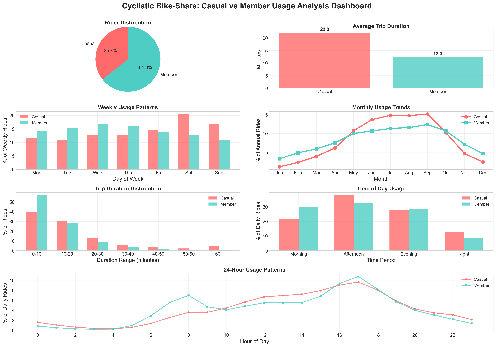

# Cyclistic Bike-Share Analysis: Understanding Rider Behavior

This project analyzes Cyclistic bike-share data to understand differences between casual riders and annual members. The goal is to identify opportunities to convert casual riders into members, focusing on ride frequency, duration, preferred bike types, popular stations, and temporal trends.  This analysis uses data from November 2023 to October 2024.

## Key Findings

* **Seasonality:** Casual ridership peaks in the summer months (June-August), while member ridership is more consistent throughout the year.
* **Weekday vs. Weekend Usage:** Casual riders predominantly use the service on weekends, while members demonstrate consistent weekday usage, suggesting commute patterns.
* **Trip Duration:** Casual riders tend to have significantly longer average trip durations than members.
* **Station Preferences:**  Casual riders and members show distinct preferences for start and end stations, with minimal overlap between the most popular locations.
* **Bike Type:**  Classic bikes are the most popular choice for both groups.

## Strategic Recommendations

Based on the findings, Cyclistic should consider the following strategies:

* **Targeted Marketing:** Focus marketing efforts on casual riders during peak season (summer) and weekends, emphasizing leisure and recreational use cases.
* **Pricing Incentives:** Offer weekend or summer-specific passes/discounts to attract casual riders, potentially converting them to annual memberships.
* **Commute-Focused Promotions:**  Target weekday commuters with promotions highlighting the convenience and cost-effectiveness of membership for regular travel.
* **Station-Based Promotions:**  Leverage the identified differences in station preferences. Offer promotions or incentives at stations popular with casual riders to encourage membership uptake.

## Data Source

Cyclistic's historical trip data (November 2023 - October 2024) was obtained from [https://divvy-tripdata.s3.amazonaws.com/index.html](https://divvy-tripdata.s3.amazonaws.com/index.html) for the Google Data Analytics Capstone project.  The data is provided as CSV files within ZIP archives, each representing a single month's worth of trip data.

## Methodology

### Data Integration and Cleaning

Data from twelve monthly ZIP archives was downloaded and combined using Python and the Pandas library. The following data quality issues were identified and addressed:

* **Duplicate Ride IDs:** 422 duplicate records (0.01%) were found, likely due to timestamp formatting inconsistencies. The last occurrence of each duplicate was retained.
* **Missing Station Data:** 531,150 records (9.58%) had missing start and/or end station names.  Rows with *both* start and end station names missing were removed, as they limited geographic analysis.
* **Invalid Timestamps:** 160 records (<0.01%) had end times before start times. These illogical entries were removed.
* **Invalid Durations:** 8,109 records (0.15%) had durations of zero or greater than 24 hours. These records were filtered out.

### Data Transformation

New features were engineered to facilitate analysis:

* **Time-Based Features:** Hour of the day, day of the week, month, and time period (Morning, Afternoon, Evening, Night) were extracted from timestamps.
* **Trip Duration Categories:** Ride durations were categorized into bins (e.g., 0-10 minutes, 10-20 minutes, etc.) for easier analysis of usage patterns.

### Exploratory Data Analysis

The cleaned and transformed data was analyzed to understand rider behavior, focusing on:

* **Rider Type Distribution:** Overall proportion of casual riders vs. members.
* **Temporal Usage Patterns:**  Ride frequency across months, days of the week, and hours of the day.
* **Trip Duration Analysis:** Average and median trip durations for each rider type.
* **Bike Type Preferences:**  Popularity of different bike types for casual riders and members.
* **Station Popularity:** Identification of most frequently used start and end stations.
* **Station Usage Concentration:** Measurement of how concentrated usage is among popular stations.

### Visualization

Matplotlib, Seaborn, and Plotly were used to create visualizations, including bar charts, pie charts, line plots, box plots, heatmaps, and a map to visually communicate the key findings.

## Data Quality and Limitations (See notebook for full details)

90.4% of the original data was retained after cleaning.  Limitations include missing station data in some records and the reliance on inferred ride purposes.

## Repository Structure

* `eda.ipynb`: Jupyter notebook containing the analysis.
* `top_start_stations_map.png`: Map visualization.
* `top_start_stations_map.html`: Interactive map.
* `README.md`: This file.

## How to Run the Code

1. **Prerequisites:** Python 3, Jupyter Notebook, Pandas, NumPy, Matplotlib, Seaborn, Plotly.
2. **Installation:** `pip install pandas numpy matplotlib seaborn plotly`
3. **Run:** Open `eda.ipynb` in Jupyter Notebook and run all cells.

## Conclusion

This analysis successfully identified key differences in how casual riders and members use the Cyclistic bike-share system.  The findings provide a valuable foundation for targeted marketing and pricing strategies to convert casual riders into annual members, ultimately contributing to Cyclistic's growth and success.
